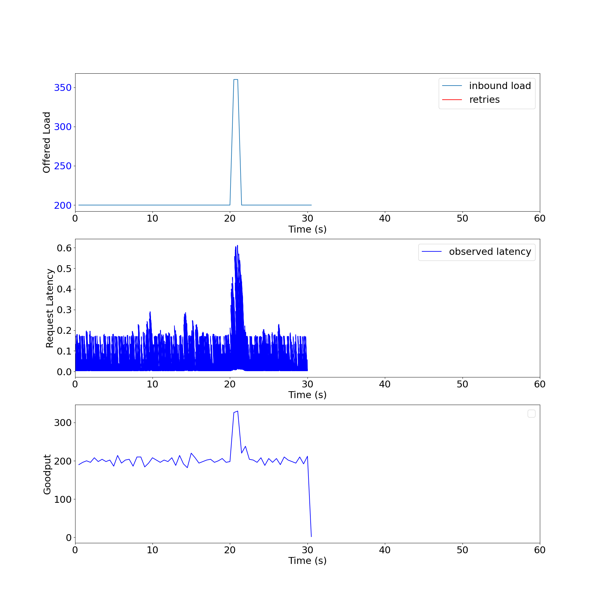

# bufferbloater
A configurable client/server bufferbloat simulation.

## Building

Just run `make`.

## Configuration

A basic configuration file looks something like this:
```
client:
  workload:
    - rps: 200 
      duration: 20s 
  rq_timeout: 5s
  target_server:
    address: 0.0.0.0
    port: 9002
server:
  profile:
    - duration: 20s
      latency_distribution:
      - weight: 90
        latency: 5ms
      - weight: 5
        latency: 50ms
      - weight: 4
        latency: 100ms
      - weight: 1
        latency: 250ms
  listen_port: 9002
  threads: 4
```

### Client

The client configuration allows a user to specify stages of variable durations
at a specific request rate (RPS). In the example above, the client will send
HTTP `GET` requests to `0.0.0.0:9002` at a rate of 10 RPS for 10 seconds,
followed by a rate of 20 RPS for 50 seconds.

### Server

The server configuration, similar to the client, allows a user to specify stages
in the server's lifetime. The `workload` field contains an obvious `duration
field`; however, the `latency_distribution` field controls how long the server
will spend "servicing" a request. The latency distributions can be weighted to
emulate desired tail latencies or more sophisticated service degradation.

The `threads` field controls how many worker threads are allowed to "service"
requests.

## Generating data

CSV files are created for each run and placed in a folder called `data`. If
files already exist in that folder, they will be overwritten. The bufferbloater
will only create files if there is data that needs to be written to it.

There is a lot of polish left to do in this area. An example graph can be found
below.


